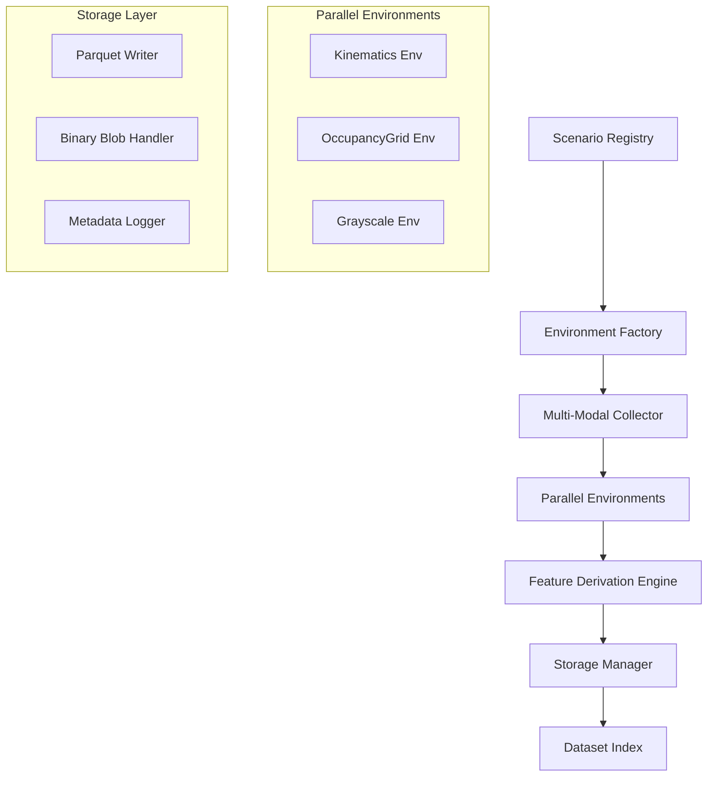
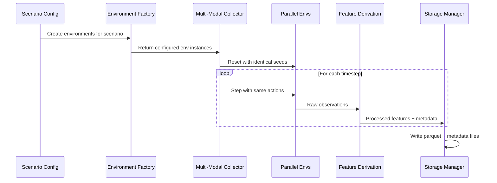

# Design Document

## Overview

The HighwayEnv Multi-Modal Data Collection System is designed as a modular, scalable framework for capturing synchronized observations across multiple modalities in multi-agent highway driving scenarios. The system leverages parallel environment execution with deterministic seeding to ensure perfect alignment of observations across Kinematics, OccupancyGrid, and Grayscale modalities.

The architecture follows a pipeline approach: Scenario Configuration → Environment Creation → Synchronized Data Collection → Feature Derivation → Storage & Indexing. This design supports both batch data collection for offline training and extensible policy integration for online data generation.

## Architecture

### High-Level Architecture



### Data Flow Architecture



## Components and Interfaces

### 1. Scenario Registry (`ScenarioRegistry`)

**Purpose:** Centralized configuration management for curriculum scenarios

**Interface:**
```python
class ScenarioRegistry:
    def get_scenario_config(self, scenario_name: str) -> Dict[str, Any]
    def list_scenarios(self) -> List[str]
    def validate_scenario(self, config: Dict[str, Any]) -> bool
```

**Key Responsibilities:**
- Store predefined scenario configurations (vehicles_count, lanes_count, duration)
- Validate scenario parameters against HighwayEnv constraints
- Support extensible scenario definitions

### 2. Environment Factory (`MultiAgentEnvFactory`)

**Purpose:** Create and configure HighwayEnv instances for different observation modalities

**Interface:**
```python
class MultiAgentEnvFactory:
    def create_env(self, scenario_name: str, obs_type: str, n_agents: int) -> gym.Env
    def create_parallel_envs(self, scenario_name: str, n_agents: int) -> Dict[str, gym.Env]
    def get_base_config(self, scenario_name: str, n_agents: int) -> Dict[str, Any]
```

**Key Responsibilities:**
- Generate consistent multi-agent configurations across modalities
- Handle observation type switching (Kinematics, OccupancyGrid, GrayscaleObservation)
- Ensure identical base configurations for synchronization

### 3. Multi-Modal Collector (`SynchronizedCollector`)

**Purpose:** Orchestrate parallel environment execution and data synchronization

**Interface:**
```python
class SynchronizedCollector:
    def collect_episode_batch(self, scenario_name: str, episodes: int, seed: int) -> CollectionResult
    def step_parallel_envs(self, actions: Tuple[int, ...]) -> Dict[str, Any]
    def reset_parallel_envs(self, seed: int) -> Dict[str, Any]
```

**Key Responsibilities:**
- Maintain synchronization across parallel environments
- Handle episode termination conditions consistently
- Coordinate action sampling and policy integration

### 4. Feature Derivation Engine (`FeatureDerivationEngine`)

**Purpose:** Process raw observations into derived metrics and summaries

**Interface:**
```python
class FeatureDerivationEngine:
    def derive_kinematics_features(self, obs: np.ndarray) -> Dict[str, float]
    def calculate_ttc(self, ego: np.ndarray, others: np.ndarray) -> float
    def generate_language_summary(self, ego: np.ndarray, others: np.ndarray, config: Dict) -> str
    def estimate_traffic_metrics(self, observations: np.ndarray) -> Dict[str, float]
```

**Key Responsibilities:**
- Calculate Time-to-Collision from relative dynamics
- Generate natural language descriptions of driving context
- Estimate lane positions, gaps, and traffic density
- Support extensible feature derivation

### 5. Storage Manager (`DatasetStorageManager`)

**Purpose:** Handle efficient storage of multi-modal observations and metadata

**Interface:**
```python
class DatasetStorageManager:
    def write_episode_batch(self, data: List[Dict], metadata: List[Dict], scenario: str) -> StoragePaths
    def encode_binary_arrays(self, arrays: Dict[str, np.ndarray]) -> Dict[str, Any]
    def create_dataset_index(self, scenario_paths: List[StoragePaths]) -> Path
```

**Key Responsibilities:**
- Serialize large arrays as binary blobs with metadata
- Write Parquet files with CSV fallback
- Generate global dataset index for easy loading
- Organize files by scenario and episode

## Data Models

### Core Data Structures

```python
@dataclass
class ObservationRecord:
    episode_id: str
    step: int
    agent_id: int
    action: int
    reward: float
    
    # Kinematics features
    kin_presence: float
    kin_x: float
    kin_y: float
    kin_vx: float
    kin_vy: float
    kin_cos_h: float
    kin_sin_h: float
    
    # Derived features
    ttc: float
    summary_text: str
    
    # Binary blob references
    occ_blob: bytes
    occ_shape: List[int]
    occ_dtype: str
    gray_blob: bytes
    gray_shape: List[int]
    gray_dtype: str

@dataclass
class EpisodeMetadata:
    episode_id: str
    scenario: str
    config: Dict[str, Any]
    modalities: List[str]
    n_agents: int
    total_steps: int
    seed: int
```

### Storage Schema

**Parquet Schema:**
- Primary keys: episode_id, step, agent_id
- Numeric features: All kinematics and derived metrics as float64
- Text features: summary_text as string
- Binary data: blob columns as bytes with separate shape/dtype columns

**Directory Structure:**
```
dataset_highway/
├── free_flow/
│   ├── {timestamp}-{uuid}_transitions.parquet
│   └── {timestamp}-{uuid}_meta.jsonl
├── dense_commuting/
│   └── ...
├── lane_closure/
│   └── ...
└── index.json
```

## Error Handling

### Environment Synchronization Errors

**Strategy:** Fail-fast with detailed logging
- Detect desynchronization through observation shape/content validation
- Log environment states before failure for debugging
- Implement automatic retry with fresh seeds on synchronization failure

### Storage Failures

**Strategy:** Graceful degradation with fallbacks
- Parquet write failure → automatic CSV fallback
- Disk space issues → early termination with partial dataset preservation
- Corruption detection through checksum validation

### Memory Management

**Strategy:** Streaming processing with configurable batching
- Process episodes in configurable batches to manage memory usage
- Implement lazy loading for large binary arrays
- Clear environment states between episodes to prevent memory leaks

## Testing Strategy

### Unit Testing

**Component-Level Tests:**
- `ScenarioRegistry`: Configuration validation and retrieval
- `FeatureDerivationEngine`: TTC calculation accuracy, language summary quality
- `DatasetStorageManager`: Binary encoding/decoding, file I/O operations
- `MultiAgentEnvFactory`: Environment configuration consistency

**Test Data:**
- Synthetic observation arrays with known expected outputs
- Predefined scenario configurations for validation
- Mock environments for isolated component testing

### Integration Testing

**End-to-End Scenarios:**
- Single-episode collection across all modalities
- Multi-episode batch processing with different seeds
- Storage and retrieval round-trip validation
- Synchronization verification across parallel environments

**Performance Testing:**
- Memory usage profiling during large batch collection
- Storage throughput measurement for different array sizes
- Environment creation/reset timing analysis

### Validation Testing

**Data Quality Assurance:**
- Synchronization verification: identical trajectories across modalities
- Feature derivation accuracy: TTC calculations against ground truth
- Language summary coherence: manual review of generated descriptions
- Storage integrity: binary array reconstruction validation

**Scenario Coverage:**
- All six curriculum scenarios with various parameter combinations
- Edge cases: single agent, maximum agents, minimal/maximal episode lengths
- Error conditions: environment failures, storage limitations

## Performance Considerations

### Memory Optimization

- **Streaming Processing:** Process episodes individually rather than loading entire datasets
- **Binary Compression:** Use efficient encoding for large arrays (float32 for occupancy grids)
- **Lazy Loading:** Load binary blobs only when accessed, not during initial DataFrame operations

### Computational Efficiency

- **Parallel Environment Reuse:** Minimize environment creation overhead through reuse
- **Vectorized Operations:** Use NumPy vectorization for feature derivation calculations
- **Batch Processing:** Group file I/O operations to reduce system call overhead

### Storage Optimization

- **Columnar Storage:** Leverage Parquet's columnar format for efficient querying
- **Compression:** Enable Parquet compression for reduced disk usage
- **Indexing Strategy:** Organize files by scenario for efficient subset loading

## Extensibility Points

### Policy Integration

**Design Pattern:** Strategy pattern for action sampling
```python
class ActionSampler(ABC):
    @abstractmethod
    def sample_actions(self, observations: Dict[str, Any], n_agents: int) -> Tuple[int, ...]

class RandomActionSampler(ActionSampler): ...
class PolicyActionSampler(ActionSampler): ...
```

### Custom Modalities

**Design Pattern:** Plugin architecture for observation types
```python
class ModalityProcessor(ABC):
    @abstractmethod
    def process_observation(self, obs: Any) -> Dict[str, Any]
    @abstractmethod
    def get_storage_schema(self) -> Dict[str, type]
```

### Feature Extensions

**Design Pattern:** Composable feature derivation
```python
class FeatureExtractor(ABC):
    @abstractmethod
    def extract_features(self, obs: np.ndarray, context: Dict) -> Dict[str, Any]
```

This design provides a robust, scalable foundation for multi-modal autonomous driving data collection while maintaining flexibility for research extensions and policy integration.